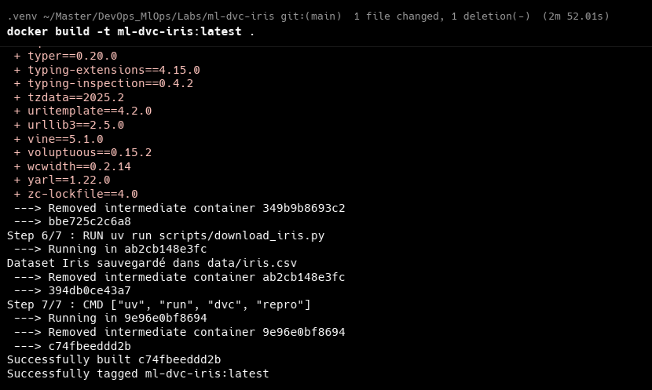
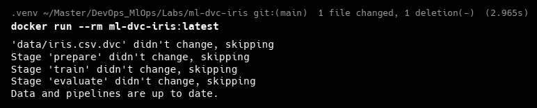
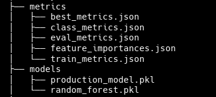

# Rapport TP2 : Intégration MLOps complète

**Module :** DevOps & MLOps  
**Professeur :** Pr. Soufiane HAMIDA  
**Date :** 08 Décembre 2025

---

## 1. Introduction

Ce travail pratique a pour but de transformer un projet de Machine Learning existant (`ml-dvc-iris`) en une chaîne MLOps complète et automatisée. L'objectif est d'intégrer les meilleures pratiques DevOps au cycle de vie du modèle : intégration continue (CI), versionning des données, reporting automatique, conteneurisation et déploiement conditionnel.

## 2. Description de l'architecture MLOps

L'architecture mise en place repose sur l'interaction de plusieurs outils :

- **DVC (Data Version Control) :** Pour orchestrer le pipeline (prepare, train, evaluate, deploy) et versionner les données.
- **Google Drive :** Sert de stockage distant (Remote) pour les fichiers lourds trackés par DVC.
- **GitHub Actions :** Assure l'automatisation (CI). À chaque modification, il ré-exécute le pipeline dans un environnement propre.
- **CML (Continuous Machine Learning) :** Permet de remonter les métriques du modèle directement dans les Pull Requests GitHub.
- **Docker :** Garantit la portabilité de l'environnement d'exécution.

---

## 3. Réalisation du TP (Étape par Étape)

### Étape 1 : Vérification du projet de départ

Nous avons d'abord validé le fonctionnement local du pipeline DVC hérité du TP1. La commande `dvc repro` permet de rejouer toutes les étapes (préparation, entraînement, évaluation).

### Étape 2 : Workflow GitHub Actions avec DVC et CML

Nous avons configuré un workflow CI (`.github/workflows/mlops-pipeline.yml`) qui installe les dépendances (via `uv`), configure DVC et exécute le pipeline.

_Vue du pipeline configuré dans l'onglet Actions de GitHub :_

_Détail d'une exécution réussie (toutes les étapes sont vertes) :_
.png>)

### Étape 3 : Remote DVC Google Drive

Un remote Google Drive a été configuré pour stocker les artefacts. Nous avons testé la synchronisation montante (`push`) et descendante (`pull`).

_Envoi des données vers le Drive (dvc push) :_

_Récupération des données depuis le Drive (dvc pull) :_

_Vérification de la présence des fichiers sur Google Drive :_
.png>)

### Étape 4 : Containerisation avec Docker

Pour assurer la reproductibilité, nous avons créé une image Docker contenant tout l'environnement nécessaire.

_Construction de l'image (docker build) :_

_Exécution du pipeline dans le conteneur (docker run) :_

### Étape 5 : Test End-to-End sur Pull Request

Nous avons simulé une modification d'hyperparamètre dans une branche de test (`feature/test-mlops`). CML a automatiquement posté un rapport comparatif dans la Pull Request.

_Rapport CML (Partie 1 : Métriques d'entraînement) :_

_Rapport CML (Partie 2 : Métriques d'évaluation et graphiques) :_

### Étape 6 : Déploiement automatique du meilleur modèle

Enfin, nous avons ajouté une étape de déploiement (`deploy`) qui promeut le modèle en production si son accuracy dépasse celle du meilleur modèle historique.

_Exécution de dvc repro incluant la nouvelle étape 'deploy' :_

_Arborescence finale montrant le modèle de production généré :_

---

## 4. Difficultés rencontrées et Solutions

1.  **Gestion des dépendances (`uv`) :** L'utilisation de `uv` au lieu de `pip` standard a nécessité d'adapter les commandes dans le workflow GitHub Actions et le Dockerfile (`uv sync`, `uv run`).
2.  **Package CML :** L'installation de la librairie Python `cml` posait problème. Nous avons résolu cela en utilisant uniquement l'outil CLI `cml` fourni par l'action GitHub, sans l'installer comme dépendance Python.
3.  **Authentification Google Drive :** La configuration par défaut des secrets GitHub pour DVC attendait un compte de service. Nous avons dû reconfigurer le workflow pour accepter nos identifiants utilisateur (User Credentials) via `gdrive_user_credentials_file`.

---

## 5. Conclusion

Ce TP nous a permis de mettre en place une chaîne **MLOps complète** intégrant DVC, GitHub Actions, CML, Docker et Google Drive.

**Stratégie de promotion :**
Nous avons implémenté une stratégie de "Champion/Challenger" simple. Le script de déploiement compare l'accuracy du nouveau modèle (Challenger) avec celle du meilleur modèle enregistré (Champion). Si le Challenger est meilleur, il remplace le Champion (`production_model.pkl`) et devient la nouvelle référence.

**Limites et Améliorations :**

- **Tests :** Il manque des tests unitaires (pytest) pour valider le code avant l'entraînement.
- **Monitoring :** Une fois déployé, le modèle n'est pas surveillé. Il faudrait ajouter un monitoring de la dérive des données (Data Drift).
- **Déploiement :** Le déploiement actuel est une copie de fichier locale. Dans un cas réel, cela déclencherait le déploiement d'une API REST (ex: FastAPI) sur un serveur cloud ou Kubernetes.
